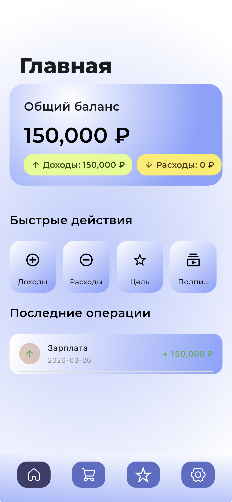

# FinControl

> Личный финансовый менеджер на Python + Flet с Telegram-ботом

[](https://python.org)
[](https://flet.dev)
[](https://aiogram.dev)
[](https://sqlite.org)
[](https://flet.dev/docs/publish)

## О проекте

**FinControl** — это не просто трекер расходов. Это **3-в-1: аналитик, мотиватор и симулятор**. Приложение не только показывает, сколько вы потратили — оно предупреждает о списаниях, помогает планировать цели и моделирует сценарии «что, если я куплю...».

Одна кодовая база на Python покрывает iOS, Android, десктоп и веб одновременно: Flet транслирует Python-код в нативный Flutter UI под капотом. Без Swift, без Kotlin, без React Native. Приложение и Telegram-бот работают поверх одной локальной SQLite-базы — без внешних серверов.

## Скриншоты

<p align="center">
  
</p>

## Возможности

### Доходы и расходы
- Регулярные доходы (зарплата с авто-начислением 1-го числа) и разовые поступления
- Быстрый ввод расходов прямо с главного экрана
- 10 категорий расходов: Еда, Транспорт, Здоровье, Покупки, Развлечения, Жильё, Образование, Накопления, Подписки, Другое
- История транзакций с фильтрацией по типу

### Финансовые цели
- Создание цели с суммой и дедлайном
- Автоматический расчёт необходимого ежемесячного взноса
- Пополнение цели реально списывает деньги с баланса (как расход «Накопления»)
- Прогресс-бар, темп накопления, визуальное достижение 100%

### Подписки
- Учёт ежемесячных и ежегодных подписок
- Автоматическое списание в день `charge_day` при логине
- Расчёт суммарной стоимости в месяц (ежегодные ÷ 12)
- Пауза/возобновление, расчёт даты следующего списания

### Бюджеты
- Лимиты по категориям (месячные / годовые)
- Прогресс-бары и предупреждения при приближении к лимиту
- Отдельный экран управления, открывается из аналитики

### Аналитика
- Сводные плашки за выбранный год: доходы, расходы, экономия, норма сбережений
- BarChart: доходы vs расходы по месяцам
- LineChart: накопленный баланс по месяцам
- Структура расходов по категориям, разбивка за период с фильтром
- Тренд за 6 месяцев

### Симулятор «что если»
- Хватит ли денег до зарплаты после покупки
- На сколько отодвинется цель, если купить X сейчас
- Как новая подписка изменит свободный остаток
- Эффект сокращения категории расходов на скорость накопления

### Telegram-бот
- Быстрый ввод транзакций командами: `+5000 зарплата` / `-300 кафе`
- Авто-категоризация по ключевым словам
- Уведомления о списаниях подписок, дедлайнах целей, превышении бюджета
- Таймеры обдумывания покупок (5 минут) с кнопками «В цель / Купил / Передумал»
- Быстрая статистика командой `/stats`
- Привязка аккаунта через deep link

## Стек

| Компонент | Технология |
|---|---|
| UI | Flet 0.85.0, flet-charts 0.85.0 |
| Backend | Python 3.13, SQLite (без ORM) |
| Бот | aiogram 3.27, APScheduler 3.11, Python 3.11 |
| Пакетный менеджер | uv (`pyproject.toml`) |

## Структура репозитория

```
FinControl/
├── fincontrolapp/          # Flet-приложение (источник истины для БД)
│   ├── main.py             # Точка входа, роутер, авто-операции при логине
│   ├── database.py         # Схема БД, миграции, get_connection()
│   ├── db_queries.py       # Плоский SQL-API (используется ботом напрямую)
│   ├── calculations.py     # Чистые финансовые вычисления (симулятор x4)
│   ├── utils.py            # Вспомогательные утилиты
│   ├── pages/              # UI-экраны (по одному файлу на экран)
│   ├── controllers/        # Бизнес-логика экранов
│   ├── components/         # BasePage, AppTheme, диалоги, NavBar
│   ├── modules/            # Слои данных по сущностям (model/repository/service)
│   └── assets/             # Шрифты (Montserrat x5), иконки SVG
├── bot/                    # Telegram-бот
│   ├── START_BOT.py        # Точка входа бота
│   ├── handlers/           # Роутеры aiogram (start, quick_add, stats, notify, ...)
│   ├── keyboards/          # Reply и inline-клавиатуры
│   └── utils/              # categorizer, db_async, db_safe, formatters
├── docs/                   # Документация: requirements, diagrams, screenshots
├── tests/                  # pytest
├── ARCHITECTURE.md         # Подробное описание архитектуры
├── CODEBASE.md             # Пофайловый обзор кода
└── pyproject.toml          # Зависимости Flet-приложения
```

Для разработчиков:
- **[ARCHITECTURE.md](ARCHITECTURE.md)** — потоки данных, паттерны, жизненный цикл запросов
- **[CODEBASE.md](CODEBASE.md)** — обзор всех модулей и функций

## Запуск

### Локально (Flet-приложение)

```bash
cd fincontrolapp
uv run python main.py
```

При первом запуске автоматически создаются все таблицы и стартовые категории. Сессия пользователя сохраняется в `fincontrolapp/session.json` — при следующем запуске вход выполняется без пароля.

### iOS / Android (через Flet-приложение на устройстве)

1. Установите официальное приложение **Flet** из App Store / Google Play.
2. Запустите сервер разработки из корня проекта:
   ```bash
   uv run flet run --ios fincontrolapp/main.py
   # или для Android:
   uv run flet run --android fincontrolapp/main.py
   ```
3. Отсканируйте QR-код из приложения Flet на устройстве.

На iOS база данных хранится в `~/Documents/database.db`. Размер окна фиксирован **390×844** — вёрстка заточена под мобильный портрет.

### Telegram-бот

1. Создайте `bot/.env`:
   ```
   BOT_TOKEN=ваш_токен_от_BotFather
   ```
2. Установите зависимости и запустите (отдельный терминал, Python 3.11):
   ```bash
   python -m bot.START_BOT
   ```

Бот читает ту же SQLite-базу через `fincontrolapp.db_queries`. Отдельной базы у бота нет.

## Архитектура

Кратко — основные паттерны:

- **Template Method** — `BasePage` определяет скелет рендеринга (`build_header` + `build_body` + `refresh`), каждая страница переопределяет только `build_body()`.
- **Repository** — каждая сущность имеет три слоя: `model.py` + `repository.py` + `service.py` в `modules/<entity>/`. Бот использует плоский `db_queries.py` напрямую.
- **DI через `page.data`** — глобальное состояние сессии (`user_id`, `navigate`, `logout`) передаётся через словарь `page.data`, контроллеры принимают `user_id` через конструктор.

Подробнее — в [ARCHITECTURE.md](ARCHITECTURE.md).

## Навигация

| Индекс | Страница | Nav bar | Откуда открывается |
|---|---|---|---|
| 0 | HomePage | ✅ | — |
| 1 | AnalyticsPage | ✅ | — |
| 2 | GoalsPage | ✅ | — |
| 3 | SettingsPage | ✅ | — |
| 4 | SubscriptionsPage | — | HomePage |
| 5 | IncomePage | — | HomePage |
| 6 | ExpensesPage | — | HomePage |
| 7 | TransactionsPage | — | HomePage |
| 8 | SimulatorPage | ✅ | — |
| 9 | BudgetPage | — | AnalyticsPage |

Страницы создаются лениво — при первом переходе, не при запуске.

## База данных

Файл: `fincontrolapp/database.db` (создаётся автоматически).

| Таблица | Назначение |
|---|---|
| `users` | Пользователи: email/телефон, password_hash, telegram_id, настройки валюты и уведомлений |
| `categories` | Категории доходов и расходов |
| `transactions` | Доходы и расходы (флаг `is_recurring` для зарплаты) |
| `goals` | Финансовые цели (`target_amount`, `current_amount`, `deadline`) |
| `subscriptions` | Подписки (`charge_day`, `period`, `is_paused`) |
| `budgets` | Лимиты по категориям (`monthly`/`yearly`) |
| `purchase_timers` | Таймеры обдумывания покупок |

Все запросы параметризованы (`?`). Миграции — через `try/except ALTER TABLE` в `database.py`.

## Безопасность

- Хеширование паролей: PBKDF2-HMAC-SHA256, 100 000 итераций, уникальная соль на пользователя; хранится как `salt_hex:key_hex`
- Параметризованные SQL-запросы во всех функциях `db_queries.py` (защита от инъекций)
- Данные хранятся локально на устройстве, без внешних серверов

## Технические ограничения

- Размер окна фиксирован **390×844** — вёрстка под мобильный портрет, не менять.
- ML-библиотеки (scikit-learn, statsmodels, scipy) несовместимы с мобильной сборкой Flet — не использовать. Прогнозы реализованы через МНК вручную в `calculations.py`.
- Telegram-бот запускается локально отдельным процессом, у него свой `bot/.venv` под Python 3.11.

## Сравнение с конкурентами

|  | Дзен-мани | CoinKeeper | MoneyLover | **FinControl** |
|---|---|---|---|---|
| Учёт транзакций | ✅ | ✅ | ✅ | ✅ |
| Финансовые цели | ⚠️ | ✅ | ⚠️ | ✅ |
| Симуляция «что если» | ❌ | ❌ | ❌ | ✅ |
| Умные подписки | ✅ | ❌ | ❌ | ✅ |
| Telegram-бот | ❌ | ❌ | ❌ | ✅ |
| Прогноз бюджета | ✅ | ❌ | ❌ | ✅ |

## Статус проекта

| Компонент | Статус |
|---|---|
| UI и навигация | ✅ Готово |
| Авторизация | ✅ Готово |
| Транзакции (доходы / расходы / история) | ✅ Готово |
| Финансовые цели | ✅ Готово |
| Подписки с авто-списанием | ✅ Готово |
| Бюджеты по категориям | ✅ Готово |
| Аналитика и графики | ✅ Готово |
| Симулятор «что если» (4 сценария) | ✅ Готово |
| Telegram-бот (CRUD + категоризация) | ✅ Готово |
| Уведомления (подписки / цели / бюджет) | ✅ Готово |
| Мультивалютность | ✅ Готово |
| Профиль / переключатели уведомлений в UI | ✅ Готово |
| Экспорт данных (CSV/PDF) | 📋 Запланировано |
| Тёмная тема | 📋 Запланировано |

## Команда

| Роль | Зона ответственности | Исполнитель |
|---|---|---|
| Tech Lead + Bot Owner | Архитектура, UI, Telegram-бот | Миронов Дмитрий |
| Аналитик-1 | User Stories, формулы симулятора | Гравшина Анастасия |
| Аналитик-2 | Use Cases, ER-диаграммы | Федорова Виктория |
| Дизайнер | UI/UX, дизайн-система | Алювинова Алтана |


## Лицензия

MIT
